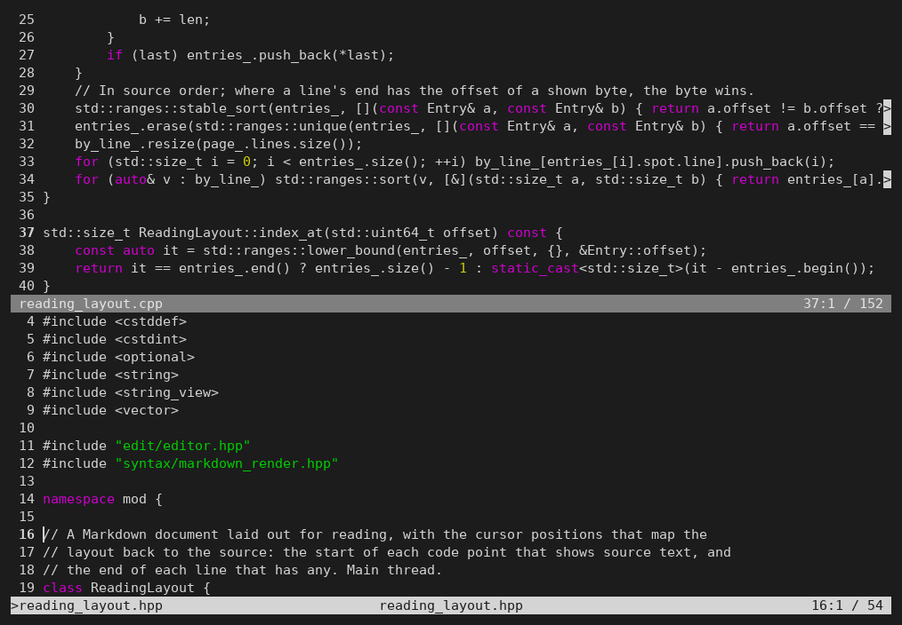
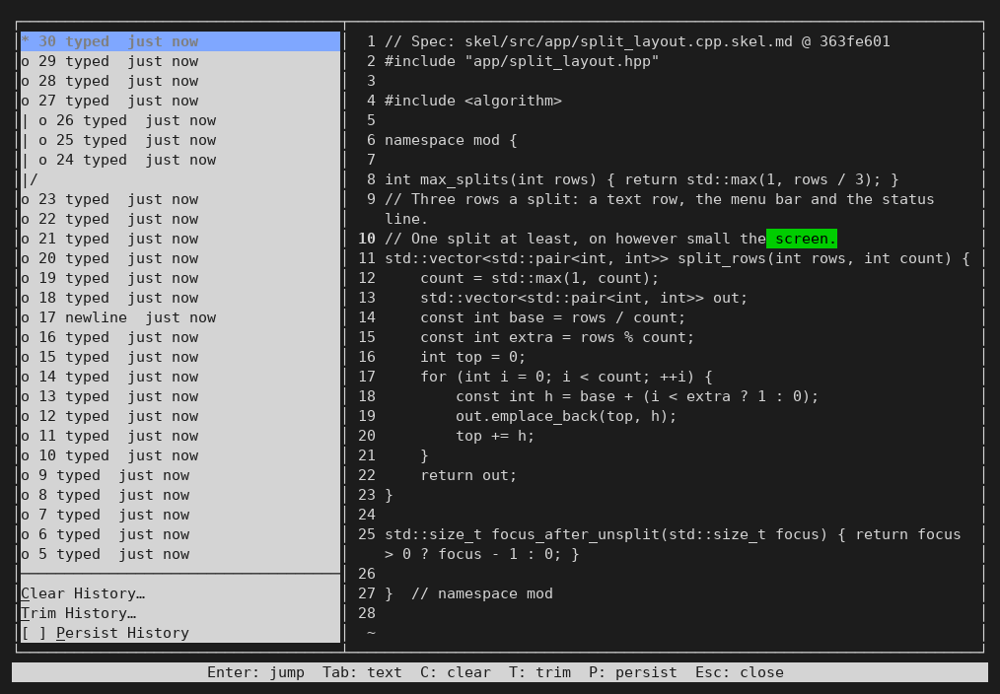

# mod

A small terminal text editor that never loses an edit: its undo history is unlimited, branched, and can be kept on disk next to your file.



## Install

On Linux x86_64:

```sh
curl -fsSL https://raw.githubusercontent.com/hanoixan/mod/main/install.sh | sh
```

The script installs the release's package with apt, dnf or pacman when it can (asking sudo for the password), and otherwise unpacks mod into `~/.local`. Set `MOD_INSTALL_LOCAL=1` to always use `~/.local`, `MOD_PREFIX` for another folder, or `MOD_VERSION` for an older release or a release candidate (`MOD_VERSION=1.2.0-rc.1`). The one-liner needs the repository to be public; until it is, download the files from the [releases page](https://github.com/hanoixan/mod/releases) instead.

Each release has:

| File | For |
|---|---|
| `mod_<version>_amd64.deb` | Debian, Ubuntu 22.04 and later: `sudo apt install ./mod_*.deb` |
| `mod-<version>-1.x86_64.rpm` | Fedora and other RPM systems: `sudo dnf install ./mod-*.rpm` |
| `mod-<version>-1-x86_64.pkg.tar.zst` | Arch: `sudo pacman -U mod-*.pkg.tar.zst` |
| `PKGBUILD` | Arch, building from source with `makepkg -si` |
| `mod-<version>-linux-x86_64.tar.gz` | any glibc 2.35+ Linux: unpack and run `bin/mod` |

From source (GCC 13 or later, CMake 3.25 or later, Ninja; the preset uses `g++-13`, so with another GCC add `-DCMAKE_CXX_COMPILER=g++`):

```sh
cmake --preset linux-release
cmake --build --preset linux-release
sudo cmake --install build/linux-release
```

## Quickstart

```sh
mod notes.md              # open a file (several files open as several documents)
mod -ro README.md         # read a Markdown file laid out, without changing it
mod --persist-history notes.md   # keep its undo history between sessions
mod --help                # every option, including any setting for one session
```

- Type to edit. **Ctrl+S** saves, **Ctrl+Q** quits (asking about unsaved changes), **Ctrl+Z** and **Ctrl+Y** undo and redo.
- **Esc** shows the menu bar on the top line; press a menu's underlined letter, then an item's. Esc again closes it.
- **F1** opens the manual; Up and Down move between its links, Enter follows one, Left goes back.

## Features

- **Undo that never forgets.** The history is a tree, not a line: undo a few steps and type something new, and the old edits stay on their own branch instead of being thrown away. Edit > Undo History… shows every branch, lets you preview any point and jump to it. There is no limit on its size, and with Persist History (or `--persist-history`) it is kept in a `.mod` file beside yours, so it survives closing the editor and rebooting.

  

- **Several documents** at once (the Documents menu), and **split views**: View > Split shows another place in the same document, or another document, above and below.
- **A folder tree** (Esc then Shift+Left, or pinned with View > Pin Folder Tree): the working folder's files beside the views, to open one or glance at it read-only.
- **Read-only mode** for reading and following links: Markdown is laid out with its marks hidden, and Tab and Enter move through its links to other files and headings.
- **Search and replace** with regular expressions, whole words and case options, and a search of the manual.
- **Syntax coloring** for C, C++, Rust, Python, Go, JavaScript, TypeScript, JSON, TOML, YAML, shell scripts, CMake and Markdown, more by adding a language to `languages.json`, with names colored by a language server (clangd, rust-analyzer, pyright, gopls, typescript-language-server) when one is installed.
- **Your keys and colors**: every command can be rebound and every color changed, from Options, and a choice of normal, night and paper looks.
- Large files open at once, their lines counted in the background; a file changed by another program is noticed and can be reloaded; saving is atomic, and mod asks before it ever writes a file in place.
- Runs in any terminal, with a VT100-only mode for old ones.

## Keys

The keys used most; the [full list](docs/manual/key-bindings.md) is in the manual, and Options > Key Bindings… changes any of them.

| Key | Does | Key | Does |
|---|---|---|---|
| `Esc` | menu bar | `F1` | manual |
| `Ctrl+S` | save | `Ctrl+Q` | quit |
| `Ctrl+Z` | undo | `Ctrl+Y` | redo |
| `Ctrl+X` | cut | `Ctrl+C` | copy |
| `Ctrl+V` | paste | `Ctrl+K` | cut to line end |
| `Ctrl+F` | find and replace | `F3` / `Shift+F3` | next / previous match |
| `Ctrl+G` | go to line | `Ctrl+T` | suspend to the shell |
| `Tab` | insert a tab (spaces to the next stop) | `Shift+Tab` | outdent the line or selection |
| `Ctrl+Left` / `Ctrl+Right` | word left / right | `Ctrl+Home` / `Ctrl+End` | start / end of file |
| `Home` / `Ctrl+A` | line start | `End` / `Ctrl+E` | line end |
| `Shift` + a move | select | `Ctrl+Backspace` / `Ctrl+Delete` | delete a word |

## Documentation

The [manual](docs/manual/index.md) covers everything, and is the same text F1 shows. [CONTRIBUTING.md](CONTRIBUTING.md) explains how changes and releases are made.

## License

MIT; see [LICENSE](LICENSE).
